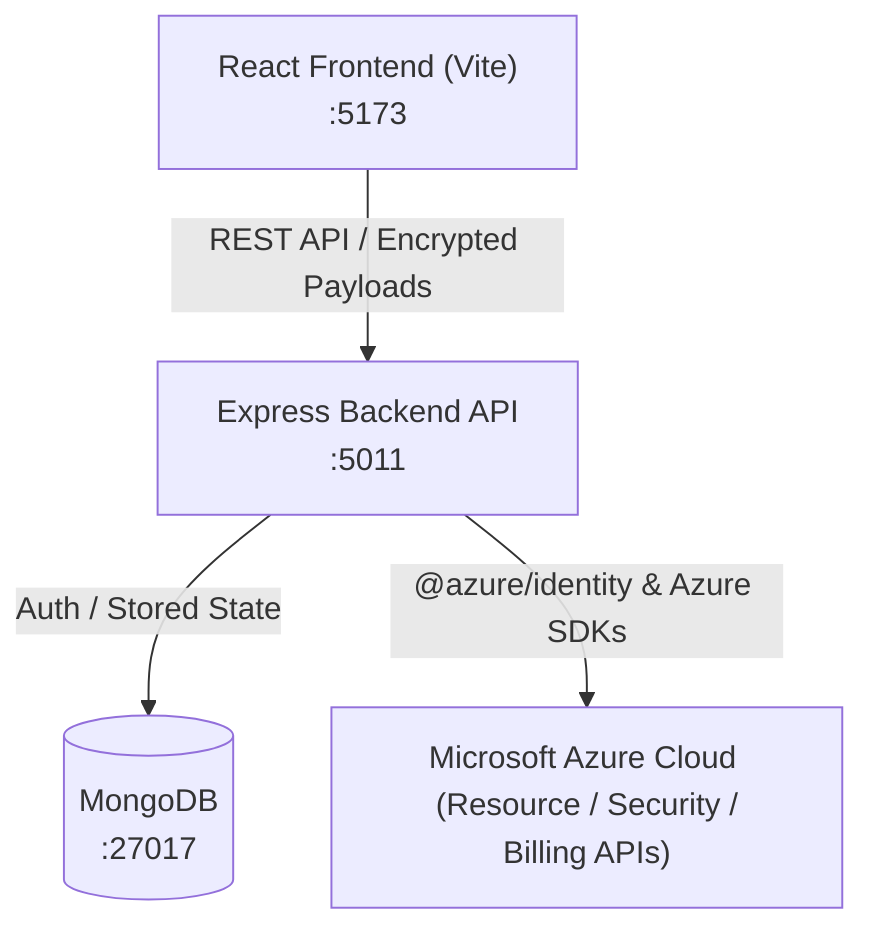

# ⚡ NervOps

> **Enterprise-grade Cloud Security Posture Management (CSPM) & Azure Infrastructure Monitoring Platform**

[](https://www.docker.com/)
[](https://reactjs.org/)
[](https://vitejs.dev/)
[](https://nodejs.org/)
[](https://www.mongodb.com/)
[](https://azure.microsoft.com/)

---

## 📖 Overview

**NervOps** is a full-stack Cloud Security Posture Management (CSPM) and infrastructure monitoring dashboard designed for Microsoft Azure. It empowers DevOps and Cloud Security engineers to discover resources, evaluate security posture against CIS/compliance checks, analyze Azure billing in real-time, and detect misconfigurations before they become security incidents.

### Key Capabilities

* 🛡️ **Automated Security Assessments**: Deep rule-based security evaluations across Azure resources (Virtual Machines, Storage Accounts, NSGs, Azure Bastion, Function Apps, and Firewalls).
* 📊 **Resource & Subscription Inventory**: Dynamic discovery of all Azure assets under multiple tenant subscriptions.
* 💳 **Real-time Cost & Billing Telemetry**: Instant insight into Azure consumption and billing metrics.
* 🔐 **Client-side Credential Encryption**: Zero plaintext credentials stored in code — Azure Service Principal credentials (`Tenant ID`, `Client ID`, `Client Secret`, `Subscription ID`) are encrypted client-side using AES-256 before transit and persistence.
* 🐳 **Containerized & Production Ready**: Fully Dockerized with blue/green deployment configurations and Docker Compose orchestrations.

---

## 🏗️ Architecture



### Tech Stack

| Layer | Technologies |
| :--- | :--- |
| **Frontend** | React 18, Vite 5, Tailwind CSS, Lucide Icons, Framer Motion, Recharts |
| **Backend** | Node.js (v23), Express 4, Mongoose, JWT, Mailtrap SDK, CryptoJS |
| **Cloud Integration** | `@azure/identity`, `@azure/arm-resources`, `@azure/arm-security`, `@azure/arm-billing`, `@azure/arm-subscriptions` |
| **Database** | MongoDB |
| **DevOps & Infra** | Docker, Docker Compose, Blue-Green deployment scripts, Nginx |

---

## 📁 Repository Structure

```
nervops/
├── frontend/                     # React + Vite admin dashboard
│   ├── src/
│   │   ├── components/           # UI widgets, metrics, tables, and settings
│   │   ├── pages/                # Overview, Analytics, Products, Users, Auth pages
│   │   ├── store/                # Zustand / Axios API auth store
│   │   └── utils/                # Crypto & date utility helpers
│   ├── Dockerfile
│   └── package.json
├── backend/                      # Express REST API
│   ├── controllers/              # Azure metrics, resources, billing & auth logic
│   ├── routes/                   # /api/auth and /api/azure route handlers
│   ├── models/                   # Mongoose schemas (User, AzureAccount)
│   ├── middleware/               # JWT token verification middleware
│   ├── Dockerfile                # Sanitized production container definition
│   └── package.json
├── docker-compose.yml            # Main Docker Compose orchestration
├── docker-compose.blue.yml       # Blue deployment compose file
├── docker-compose.green.yml      # Green deployment compose file
├── deploy.sh                     # Zero-downtime blue/green deployment script
└── .gitignore                    # Comprehensive secrets & build exclusions
```

---

## 🚀 Quick Start (Docker Compose)

### 1. Prerequisites
* [Docker Desktop](https://www.docker.com/products/docker-desktop/) (Docker v20+ and Compose v2+)
* An active [Microsoft Azure](https://portal.azure.com/) subscription with an App Registration / Service Principal

### 2. Clone Repository
```bash
git clone git@github.com:shubhamaggarwal828/nervops_prod_jenkins.git nervops
cd nervops
```

### 3. Launch Services
Run the entire stack with Docker Compose:
```bash
docker compose up -d --build
```

### 4. Access the Applications
* **Dashboard (Web UI)**: [http://localhost:5173](http://localhost:5173)
* **Backend API**: [http://localhost:5011](http://localhost:5011)
* **MongoDB**: `localhost:27017`

To check running container logs:
```bash
docker compose logs -f
```

---

## 🔑 Connecting Your Azure Subscription

To monitor your Azure tenant from the dashboard:

1. **Create an Azure Service Principal**:
   * Navigate to **Microsoft Entra ID (Azure AD)** ➔ **App registrations** ➔ **New registration**.
   * Note the **Application (client) ID** and **Directory (tenant) ID**.
2. **Generate a Client Secret**:
   * Under your app registration, go to **Certificates & secrets** ➔ **New client secret**.
   * Copy the secret **Value**.
3. **Grant IAM Permissions**:
   * Open your **Subscription** in Azure Portal ➔ **Access control (IAM)** ➔ **Add role assignment**.
   * Assign the **Reader** role to your registered application.
4. **Input to Dashboard**:
   * Open the dashboard at `http://localhost:5173`.
   * Go to **Settings ➔ Azure Account** and input your **Tenant ID**, **Client ID**, **Client Secret**, and **Subscription ID**.

---

## 🛠️ Local Development (Without Docker)

### Backend
```bash
cd backend
cp .env.example .env     # Configure your local MongoDB URI & JWT secret
npm install
node index.js
```

### Frontend
```bash
cd frontend
npm install
npm run dev
```

---

## 🔒 Security Best Practices

* **No Plaintext Storage**: Azure secrets are never stored unencrypted in the database or hardcoded in repositories.
* **Environment Isolation**: Production tokens (`JWT_SECRET`, `MAILTRAP_TOKEN`, `MONGO_URI`) are passed dynamically via environment variables or secrets managers.
* **Protected Routes**: All operational endpoints require bearer tokens issued upon secure authentication.

---

## 📄 License

This project is licensed under the ISC License.
